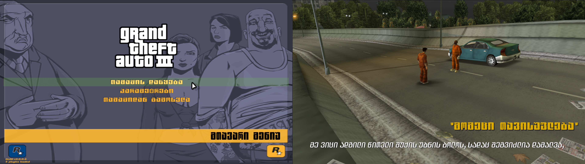

# GEO GTA III
ქართული მენიუ და სუბტიტრები GTA III-სთვის.

# ყურადღება!!!!!
თამაში სრულად გადათარგმნილი ჯერჯერობით არ არის. თავდაპირველი თარგმანი გაკეთდა translate.google.com-ის გამოყენებით. შესაბამისად, ზოგიერთი ფრაგმენტი შეიზლება შინაარსობრივად გაუგებარი იყოს. გაითვალისწინეთ ეს ;)

# როგორ ავაწყო პროექტი (ხელით)
პროექტის აწყობისთვის საჭიროა `output` საქაღალდეში არებული ყველა ფაილის შიგთავსის ხელით რედაქტირება. სამომავლოდ დავამატებ ხელსაწყოებსაც, რომ ეს პროცესი გამარტივდეს.

* fonts.txd: შეინახეთ ფონტები (ფომლებიც `/fonts` საქაღალდეშია) როგორც PNG სურათები. შემდგომ, გამოიყენეთ TXD ფაილების რედაქტორი რათა შეცვალოთ არებული ფონტები თქვენი PNG სურათებით. GTA III-ის ყველა ფონტი შეფუთნილია `/output/models/fonts.txd` ფაილში. მე გირჩევთ `Magic.TXD` რედაქტორს.
* american.gxt: გამოიყენეთ `GTA3 GTX Editor`, რათა რედაქტირება გაუკეთოთ ამ ფაილს. ეს ფაილი შეიცავს თამაშში არსებულ ტექსტს: მენიუს, სუბტიტრებს და ა.შ. არ დაგავიწყდეთ, რომ ტექსტის სიმბოლოები არის კონვერტირებული. კონვერტირება განხორციელებულია რუსული სიმბოლოების გამოყენებით: ერთი რუსული სიმბოლო შეესაბამება ერთ ქართულ ასოს (კიდევ კარგი რუსებსაც 33 ასო აქვთ ანბანში :დ).

# დაყენება
უბრალოდ ამოაარქივეთ `output` საქაღალდის შიგთავსი თქვენს GTA III-ის საქაღალდეში.

# ინფორმაცია
* `fonts` საქაღალდე შეიცავს ფონტის Photoshop-ის PSD ფაილებს. GTA III-ს აქვს 3 ფონტი: font1, font2 და ფონტი pager-ისთვის.

# ექსტრა ინფორმაცია
არ დაგავიწყდეთ `GTA III - Essential Fixes`-ის მოდის დაყენება. ეს მოდი ბევრ ხარვეზს ასწორებს: განიერი ეკრანის ხარვეზს, მენიუს ბაგებს და ა.შ: https://steamcommunity.com/sharedfiles/filedetails/?id=1744154318